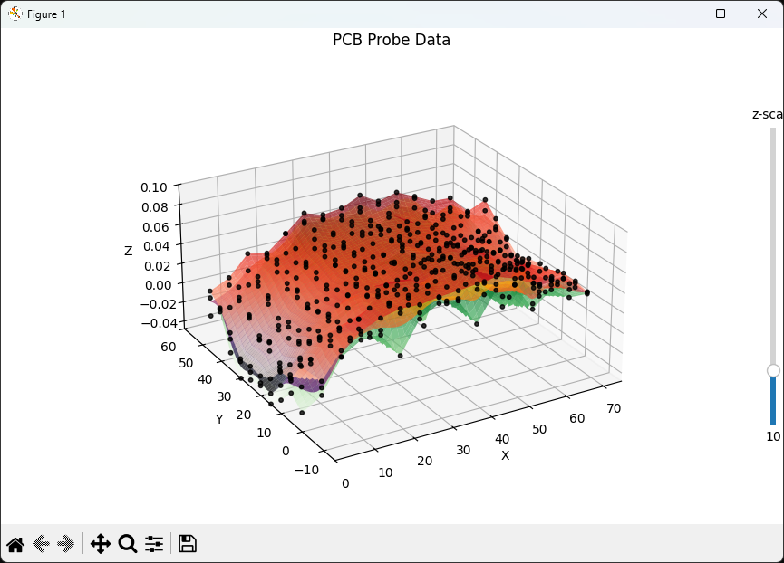

gsort.py
========
gsort.py, gsplit.py, glevel.py, gprobe_viewer.py, gprobe.ngc

---
A little G-Code sorter to speed up the PCB milling process with [PCB-GCode][1] for [Eagle][2].  
Can sort G-Code paths and eliminate useless travels. Might also be capable of splitting files
with multiple tools into separate ones, then containing only one tool.  
An auto-levelleleleler is also on the way, so is a (LinuxCNC) probing file and a probe 3D viewer.

WARNING, OLD (2007):

For a little more info, including a binary distribution, follow [this link][3]. 

Although it might have it's issues, like the currently still missing M02 command at the end of the
file (read the readme), I milled hundreds of PCB with it.

Yep, it works quite fine, but please notice that this code is (yet) from 2007 and might not
be compatible with newer PCB-GCode (or Eagle) releases.

----------------------------------------------------------------------------------------------

Originally (2007-2014) tested with:

 - pcb-gcode with EMC (EMC2, LinuxCNC) post processor
 - hp2xx

 Also working (2025), but not required (for sorting):

 - CopperCAM in LinuxCNC mode

----------------------------------------------------------------------------------------------
## MODULES

Functionality was split into several files.

---
### gsort.py

The classic paths sorter for PCB-GCode.

---
### gsplit.py

Splits a single file including multiple tools, e.g.

  - T1 engraver
  - T2 endmill milling for slots
  - T3 endmill for contours

into three separate files, each containing only one tool.

---
### glevel.py

An auto level algorithm.  
All paths exceeding a configurable max length, 5mm by default,
are split into smaller segments; afterwards, all Z-positions
are recalculated, based on a grid probed by "gprobe.ngc" below.

---
### gprobe.ngc

A LinuxCNC file for probing the PCB's surface with rectangular grid.  
Can probe the same grid multiple times to get an average of each point
(and check your machine's accuracy).

---
### gprobe_flipflop.ngc

Same as above, but with a special HAL configuration which chains in a flipflop
into the probe signals, to solve this annoying "probe tripped during non-probe move" issues.

---
### gprobe_viewer.py (and averager)

Just a simple Matplotlib/SciPy 3D viewer of the probed data.  
Supports multipleprobes per (x,y) position, min, max and average.  
Can output an averaged height correction table for auto-levellelevler.

This requires

    numpy
    matplotlib
    scipy

simply install them, if not already present, with

    pip install numpy matplotlib scipy

Depending on your installation, you might need to type "pip3" above.  
You can always check which pip belongs to which Python version by executing

    pip --version
    pip3 --version

---
### gcode_viewer.py

This loads a G-Code file for levelevellevlevlling inspection.  
Can also be used to inspect output from the great GCodeRipper.  

Same requirements as the gcode_viewer.py above.

---
## TODO
    - gradient analysis in addition to single multi-probe deviation
    - auto-fix (smooth, average) high deviations
    - add images
    - 2025 auto LeVeLlLlLing <3
    - 2025 support tool changes
    - 2025 support tool changes file splitting (file_T1, file_T2, etc.)

---
## NEWS

### CHANGES 2025/08/XX:
    - added max deviation analysis for probe (max-min too large for multiple probes)
    - added bad probe data
    - added (minimal Z-points only) G-Code viewer to review auto-levelevelleling
    - added PCB demo G-Code gcode_demo.ngc
    - added ignoring comments
    - added replacing G0/G1 by G00/G01
    - added first image \o/
    - added adjusted (levellevelled) demo PCB

### CHANGES 2025/07/XX:
    - v0.3
    - revived for Python 3
    - some code formatting and notes
    - new .gitignore
    - now tested with CopperCAM (not required though; already sorted)
    - added log file (almost)
    - added length calc & cut marker
    - took me eleven years to notice that the Github name is wrong, lol; corrected
    - added gsplit.py and glevel.py
    - added gprobe.py, the new 3D probe data viewer and sample PCB data demo
    - added gprobe.ngc

### CHANGES 2007/09/XX:
    - v0.2
    - first tests with hp2xx revealed, that hp2xx uses ";" for comments
      These lines are now changed to parenthesis-comments

### CHANGES 2007/09/XX:
    - v0.1
    - initial version

---
Have fun  
FMMT666(ASkr)  

[1]: http://www.pcbgcode.org/
[2]: http://www.cadsoft.de
[3]: http://www.askrprojects.net/software/gsort.html
